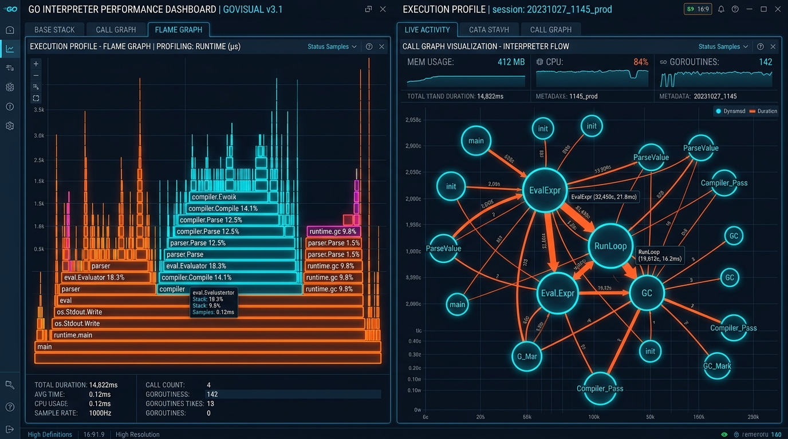

# lontara-lang

<p align="center">
    
</p>

<p align="center">
    
    
    
</p>

**Bahasa Pemrograman Edukatif Berbasis Logika Bahasa Bugis dan Aksara Lontara.**


<p align="center">
    <a href="docs/architecture/BENCHMARK.md"><strong>🔥 Flame Graph (CPU Profile)</strong></a> | 
    <a href="docs/architecture/BENCHMARK.md"><strong>🕸️ Call Graph (Visual Execution)</strong></a> | 
    <a href="docs/architecture/BENCHMARK.md"><strong>⚡ Baca Analisis Performa Lengkap</strong></a>
</p>

`lontara-lang` adalah bahasa pemrograman berjenis *tree-walking interpreter* yang dirancang untuk mengenalkan konsep ilmu komputer dan algoritma pemrograman melalui istilah lokal bahasa Bugis serta dukungan native Aksara Lontara Unicode (`U+1A00`–`U+1A1F`). Bahasa ini dikembangkan menggunakan Go (Golang) murni tanpa pustaka eksternal (*zero external dependencies*).
---

<p align="center">
    
</p>

---

## Inspirasi Proyek

Pengembangan `lontara-lang` terinspirasi dari proyek-proyek esolang edukatif Nusantara pendahulu yang mengenalkan bahasa pemrograman berbasis budaya daerah:

- **[sunda-lang](https://github.com/randspace0/sunda-lang)** – Bahasa pemrograman berbasis sintaks bahasa Sunda.
- **JawaScript** – Bahasa pemrograman berbasis sintaks bahasa Jawa.

Apresiasi setinggi-tingginya untuk para pembuat proyek tersebut atas inspirasi pelestarian budaya digital di Nusantara.

---

## Uji Coba Pertama (Hello World)

Anda dapat menulis program `lontara-lang` dalam format `.bugis` (versi Latin) atau `.lontara` (versi Aksara Lontara).

### Versi Bugis Latin (`examples/halo_dunia.bugis`)

```lontara
taroi pesang = "Halo, Dunia!";
paui(pesang);

taroi lima = 5;
taroi sepulo = 10;

taroi tambah = jamagau(x, y) {
    lisu x + y;
};

taroi hasil = tambah(lima, sepulo);
rekko (hasil >= 15) {
    paui("Hasil pencumlahan sitinaja (>= 15)");
} sangadinna {
    paui("Hasil pencumlahan kurang");
}
```

### Versi Aksara Lontara (`examples/halo_dunia.lontara`)

```lontara
ᨈᨑᨚᨕᨗ pesang = "Halo, Dunia!";
ᨄᨕᨘᨕᨗ(pesang);

ᨈᨑᨚᨕᨗ angka = 10;
ᨑᨙᨀᨚ (angka > 5) {
    ᨄᨕᨘᨕᨗ("salama");
}
```

---

## Sekilas Kata Kunci

| Konsep Umum | Bugis Latin | Aksara Lontara | Deskripsi |
| :--- | :--- | :--- | :--- |
| `let / var` | `taroi` | `ᨈᨑᨚᨕᨗ` | Deklarasi variabel |
| `func` | `jamagau` | `ᨍᨆᨁᨕᨘ` | Deklarasi fungsi |
| `if` | `rekko` | `ᨑᨙᨀᨚ` | Percabangan kondisi |
| `else` | `sangadinna` | `ᨔᨂᨉᨗᨊ` | Blok alternatif percabangan |
| `true` / `false` | `tongeng` / `banna` | `ᨈᨚᨂᨙ` / `ᨅᨊ` | Nilai boolean |
| `return` | `lisu` | `ᨒᨗᨔᨘ` | Pengembalian nilai dari fungsi |
| `print` | `paui` | `ᨄᨕᨘᨕᨗ` | Cetak nilai ke konsol |

Panduan sintaksis dan tata bahasa lengkap dapat dibaca di **[docs/algorithm/](docs/algorithm/)**.

---

## Memulai Cepat untuk Pengguna Luar

### 🌐 Opsi 1: Tanpa Install (Uji Coba Langsung di Peramban Web)
Anda dapat langsung mencoba menulis dan mengeksekusi kode secara interaktif tanpa perlu memasang aplikasi apa pun:
- Buka **[examples/playground.html](examples/playground.html)** di peramban web Anda.

---

### 💻 Opsi 2: Memasang Biner CLI Global (`lontara`)

Jika di komputer Anda sudah terpasang Go (v1.21+), Anda dapat memasang CLI `lontara` secara global tanpa perlu mengklon repositori:

```bash
go install github.com/dayattt111/lontara-lang/cmd/lontara@latest
```

*Catatan: Jika muncul error `lontara: command not found`, pastikan `$GOPATH/bin` terdaftar dalam variabel `PATH` Anda (`export PATH=$PATH:$(go env GOPATH)/bin`).*

### Menjalankan Berkas Kode Pertamamu

1. Buat berkas baru bernama `halo.bugis` dengan editor teks apapun:
   ```lontara
   taroi pesang = "Halo dari Lontara-Lang!";
   paui(pesang);
   ```

2. Eksekusi berkas menggunakan CLI:
   ```bash
   lontara halo.bugis
   # atau
   lontara run halo.bugis
   ```

### Mode Interaktif (REPL)

```bash
$ lontara
Lontara Programming Language (v0.1.0)
Ketik perintah atau ekspresi untuk mengevaluasi.
lontara> taroi a = 10;
lontara> paui(a * 2);
20
```

Panduan lengkap mengenai setup dan penanganan masalah dapat dibaca di **[docs/language/CLI.md](docs/language/CLI.md)**.

---

## Struktur Proyek

```text
.
├── LICENSE                  # Lisensi proyek (MIT License)
├── README.md                # Dokumentasi utama repositori
├── assets/                  # Berkas aset visual dan logo proyek
├── cmd/
│   ├── lontara/             # Biner CLI runner dan REPL utama (main.go)
│   └── wasm/                # Biner kompilasi WebAssembly (main.go)
├── docs/                    # Dokumentasi terstruktur proyek
│   ├── algorithm/           # Tutorial & modul belajar algoritma sintaksis
│   ├── architecture/        # Arsitektur mesin interpreter (Lexer, Parser, Evaluator)
│   ├── dictionary/          # Registri kata kunci & tabel karakter Aksara Lontara
│   ├── kontribusi/          # Panduan kontributor & tutorial penambahan kata kunci
│   ├── language/            # Spesifikasi tata bahasa & panduan penggunaan CLI
│   ├── roadmap/             # Peta jalan milestone & dokumentasi rilis Fase 2
│   └── website/             # Panduan WebAssembly (WASM) & Web Playground
├── examples/
│   ├── halo_dunia.bugis     # Contoh berkas sintaks Bugis Latin
│   ├── halo_dunia.lontara   # Contoh berkas sintaks Aksara Lontara Unicode
│   ├── perulangan.bugis     # Contoh perulangan Bugis Latin
│   ├── perulangan.lontara   # Contoh perulangan Aksara Lontara
│   ├── fungsi_bawaan.bugis  # Contoh fungsi bawaan (panjang, tipe)
│   └── playground.html      # Halaman Web Playground interaktif
├── go.mod                   # Berkas modul Go
└── pkg/
    ├── ast/                 # Node Abstract Syntax Tree (AST)
    ├── dictionary/          # Modul terisolasi kamus Aksara Lontara & pemetaan kata kunci
    ├── evaluator/           # Mesin penelusur AST dan evaluasi nilai
    ├── lexer/               # Analisis leksikal dan pembacaan token UTF-8
    ├── object/              # Tipe data runtime dan lingkup variabel (Environment)
    ├── parser/              # Parser sintaksis berbasis Pratt Parser
    ├── repl/                # Antarmuka REPL terminal interaktif
    └── token/               # Definisi token dan pencarian kata kunci
```

---

## Arsitektur Interpreter Singkat

`lontara-lang` menggunakan alur pemrosesan interpreter tradisional tanpa dependensi luar:

```text
Teks Sumber (.bugis/.lontara) ──> Lexer (Token) ──> Parser (AST) ──> Evaluator (Object Value)
```

1. **Lexer:** Memecah teks masukan UTF-8 (termasuk Aksara Lontara) menjadi urutan token.
2. **Parser:** Mengubah token menjadi struktur pohon AST menggunakan metode Pratt Parser.
3. **Evaluator:** Menelusuri pohon AST secara rekursif dan mengembalikan objek nilai runtime.

Penjelasan teknis mendalam mengenai arsitektur interpreter dapat dibaca di **[docs/architecture/README.md](docs/architecture/README.md)**.

---

## Indeks Dokumentasi Terstruktur

| Kategori | Dokumen | Deskripsi |
| :--- | :--- | :--- |
| **Model Belajar Algoritma** | **[docs/algorithm/](docs/algorithm/)** | Panduan bertahap (Print, Variabel, Percabangan, Perulangan, Fungsi, Built-in) |
| **Spesifikasi & CLI** | **[docs/language/CLI.md](docs/language/CLI.md)** | Panduan instalasi `lontara`, setup `PATH`, CLI `run`, dan REPL |
| **Keyboard & Cara Mengetik** | **[docs/language/KEYBOARD.md](docs/language/KEYBOARD.md)** | Panduan cara mengetik Aksara Lontara Unicode di Linux, Windows, Mac, & Web |
| **Arsitektur & Benchmark** | **[docs/architecture/BENCHMARK.md](docs/architecture/BENCHMARK.md)** | Analisis performa, kecepatan eksekusi (26.000+ prog/detik), Pratt Parser, & AST |
| **Kamus & Aksara Lontara** | **[docs/dictionary/](docs/dictionary/)** | Tabel huruf Lontara Unicode (`U+1A00`–`U+1A1F`) & registri kata kunci |
| **Peta Jalan & Alur Kerja** | **[docs/roadmap/WORKFLOW.md](docs/roadmap/WORKFLOW.md)** | Alur kerja pemrosesan data (Lexer -> Parser -> AST -> Evaluator) & roadmap publik |
| **WebAssembly & Web** | **[docs/website/WASM.md](docs/website/WASM.md)** | Panduan WASM engine & penggunaan Web Playground (`playground.html`) |
| **Panduan Kontribusi** | **[docs/kontribusi/PANDUAN.md](docs/kontribusi/PANDUAN.md)** | Workflow Git, standar pengujian, & tutorial menambah kata kunci |

---

## Kontribusi

Kontribusi dari komunitas sangat disukai! Silakan baca panduan lengkap alur kerja kontribusi pada **[docs/kontribusi/PANDUAN.md](docs/kontribusi/PANDUAN.md)** sebelum mengajukan Pull Request atau membuat Issue baru.

---

## Lisensi

Proyek ini didistribusikan di bawah lisensi [MIT License](LICENSE).
