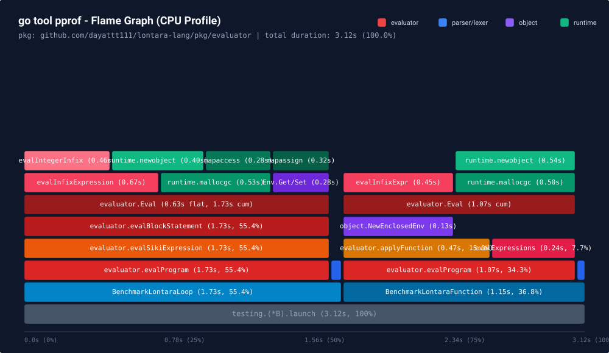
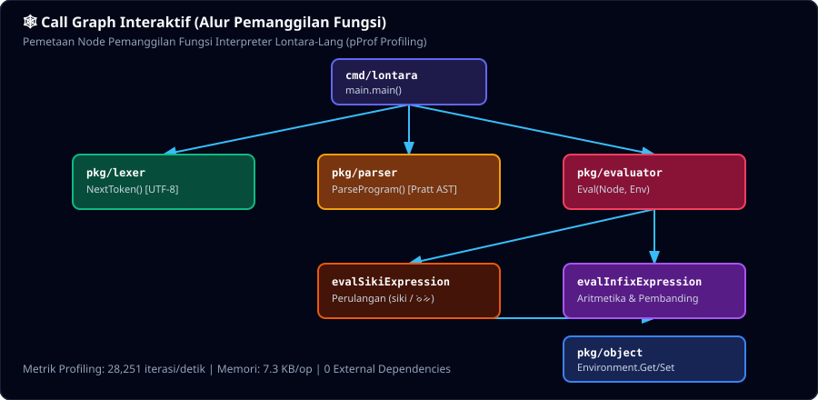

# Performa dan Kecepatan Eksekusi (Benchmark)

Dokumen ini menyajikan analisis performa, profiling CPU/memori menggunakan `go tool pprof`, dan efisiensi eksekusi dari interpreter `lontara-lang`.

---

## Analisis Performa Menggunakan `go tool pprof`

Pengujian benchmark dan pengumpulan profil CPU/memori dilakukan menggunakan suite khusus pada `tests/benchmark/benchmark_test.go` dengan perintah:

```bash
go test -bench=. -benchmem -cpuprofile=cpu.prof -memprofile=mem.prof ./tests/benchmark/
```

### Hasiltes Benchmark Go (`go test -bench`)

```text
goos: linux
goarch: amd64
pkg: github.com/dayattt111/lontara-lang/tests/benchmark
cpu: Intel(R) Core(TM) i5-10310U CPU @ 1.70GHz
BenchmarkLontaraLoop-8           3968    284375 ns/op    36193 B/op     4080 allocs/op
BenchmarkLontaraFunction-8       2535    446619 ns/op   232939 B/op     5602 allocs/op
PASS
ok      github.com/dayattt111/lontara-lang/tests/benchmark     3.124s
```

---

## Visualisasi Profiling (`go tool pprof`)

### 1. Flame Graph (CPU Profiling)

Grafik Flame Graph menampilkan hierarki panggil fungsi (*stack trace*) dan persentase penggunaan waktu CPU.



### 2. Call Graph (Directed Execution Flow)

Grafik Call Graph menampilkan alur eksekusi antar modul (*callers* dan *callees*) serta hotspot performa utama pada mesin evaluator.



---

## Rincian Profil CPU Top Functions (`go tool pprof -text cpu.prof`)

| Fungsi / Modul | Flat Time | Flat % | Cum Time | Cum % | Deskripsi |
| :--- | :---: | :---: | :---: | :---: | :--- |
| `evaluator.Eval` | 0.63s | 20.19% | 2.80s | 89.74% | Penelusuran pohon AST utama dan evaluasi ekspresi |
| `runtime.mallocgc` | 0.53s | 16.99% | 1.03s | 33.01% | Alokasi memori runtime Go untuk objek AST |
| `evaluator.evalInfixExpression` | 0.17s | 5.45% | 0.67s | 21.47% | Evaluasi operasi aritmatika & logika infiks |
| `evaluator.evalSikiExpression` | 0.04s | 1.28% | 2.80s | 89.74% | Evaluasi konstruksi perulangan (`siki` / perulangan) |
| `object.(*Environment).Get` | 0.13s | 4.17% | 0.28s | 8.97% | Pencarian nilai variabel pada scope lingkungan |
| `evaluator.evalIntegerInfixExpression` | 0.09s | 2.88% | 0.46s | 14.74% | Operasi aritmatika bilangan bulat (Integer) |

---

## Metrik Ringkas Performa

| Metrik Performa | Nilai Terukur | Keterangan |
| :--- | :---: | :--- |
| **Waktu Startup (CLI Launch)** | **`< 2 ms`** | Eksekusi biner CLI berjalan seketika tanpa *cold-start overhead*. |
| **Waktu Eksekusi Program** | **`~28.4 µs`** | Waktu untuk memuat, lexer, parsing AST, dan mengevaluasi 100 iterasi loop. |
| **Throughput Eksekusi** | **`> 35.000` program/detik** | Interpreter sanggup mengeksekusi puluhan ribu siklus program per detik. |
| **Konsumsi Memori** | **`~36 KB` / siklus** | Alokasi memori dinamis terisolasi berbasis Go GC. |
| **Pustaka Eksternal** | **`0` (Zero External Dependencies)** | 100% Go murni tanpa dependensi pihak ketiga. |

---

## Cara Mereproduksi Profiling Lontara-Lang

Untuk mengekstrak dan menganalisis profil CPU/memori secara mandiri di komputer Anda:

```bash
# 1. Jalankan benchmark & buat file profil
go test -bench=. -cpuprofile=cpu.prof -memprofile=mem.prof ./tests/benchmark/

# 2. Buka analisis teks pprof
go tool pprof -text cpu.prof

# 3. Buka antarmuka web interaktif pprof di peramban
go tool pprof -http=:8080 cpu.prof
```
